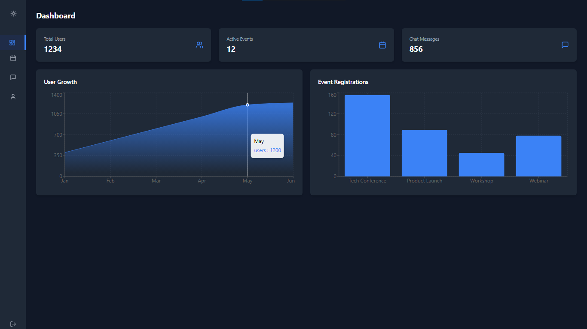

# Company App 

  
  

## Description
This is the app of a system for a company that allows:
- User registration and login with JWT authentication.
- Event management by administrators.
- Users can join events.
- Chat Live 
- dashboard with statistics.

## Contribution
1. Fork the repository
2. Create a new branch (`git checkout -b my-feature`)
3. Commit your changes (`git commit -m 'Added new feature'`)
4. Push the branch (`git push origin my-feature`)
5. Open a Pull Request

## License
This project is licensed under the MIT License.
