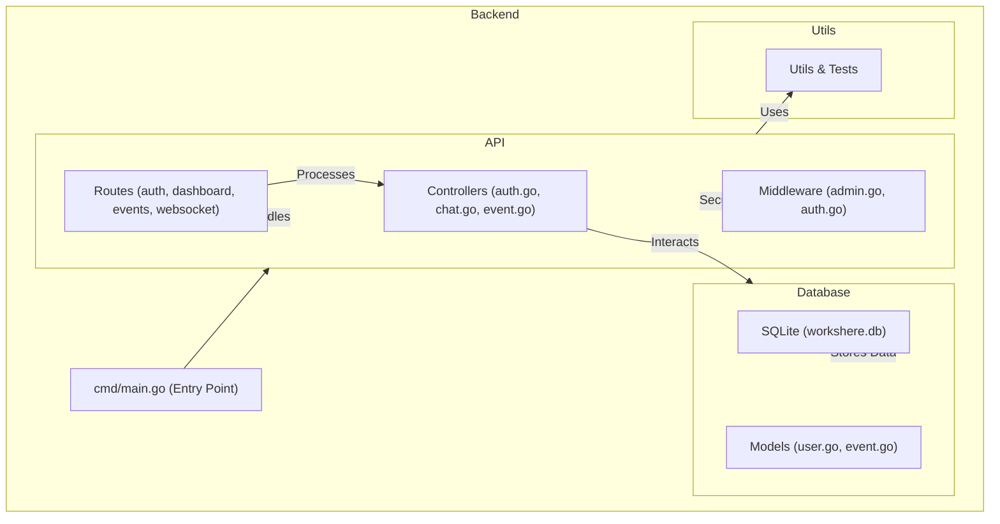

# Company App - Back-end




## Description
This is the back-end of a system for a company that allows:
- User registration and login with JWT authentication.
- Event management by administrators.
- Users can join events.
- Admin dashboard with statistics.

## Technologies Used
- **Language:** Go
- **Framework:** Gin / Fiber
- **Database:** PostgreSQL (with GORM)
- **Authentication:** JSON Web Token (JWT)
- **Hosting:** (Suggestion: Vercel, Render, or AWS)

## Project Setup

### 1. Clone the Repository
```sh
git clone https://github.com/GabrielNat1/company-app-backend.git
cd company-app-backend
```

### 2. Install Dependencies
```sh
go mod tidy
```

### 3. Configure the Database
Edit the `.env` file:
```env
PORT="you preference"
IS_LOCALHOST="is local host? true / false"
JWT_SECRET="you secret key"
ENABLE_CORS="Do you want CORS enabled? true / false"
```

Run GORM migrations:
```sh
go run main.go migrate
```

### 4. Run the Server
```sh
go run main.go
```

## API Endpoints

### **Authentication** (`/api/auth`)
- `POST /register` - User registration.
- `POST /login` - Authentication with JWT.
- `POST /reset-password` - Reset user password.

### **Events** (`/api/events`)
- `GET /` - List all events.
- `POST /` - Create event (**Admin only**).
- `POST /join/:id` - Join an event.

### **Dashboard** (`/api/dashboard`)
- `GET /` - View system statistics (**Admin only**).

### **WebSocket** (`/ws/chat`)
- `GET /:eventId` - Connect to the chat for a specific event.


## Future Improvements
- Implement WebSockets for live chat.
- Improve permission system for administrators.
- Enhance the mobile version with more features and push notifications.
### Web and Mobile Front-end
- The **web front-end** is built using **React.js**, consuming the back-end API.
- The **mobile application** is built using **React Native**, allowing access to events, registration, and live chat.

## Contribution
1. Fork the repository
2. Create a new branch (`git checkout -b my-feature`)
3. Commit your changes (`git commit -m 'Added new feature'`)
4. Push the branch (`git push origin my-feature`)
5. Open a Pull Request

## License
This project is licensed under the MIT License.
